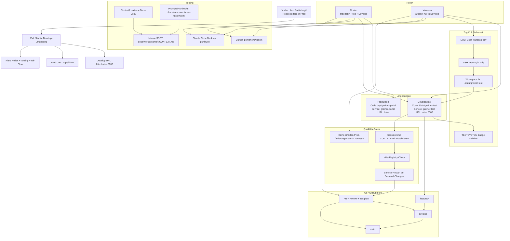

# DRIVE Migration: Neue Entwicklungsumgebung

## Kurzfassung fuer Besprechung mit Vanessa

- Wir entwickeln stabil auf `http://drive:5002` statt mit `/test`-Prefix.
- Vanessa arbeitet nur in `/data/greiner-test` mit `vanessa-dev`.
- Cursor ist das Haupttool, Claude nur ergänzend.
- Fachliche Wahrheit bleibt in `docs/workstreams/*/CONTEXT.md`.
- Git-Fluss: `feature/* -> develop -> main` mit Review-Gate.

