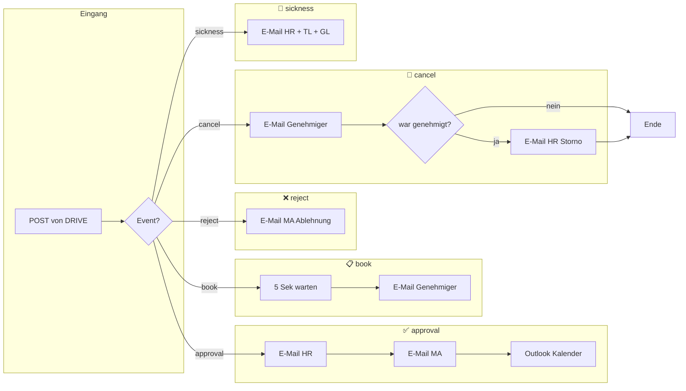
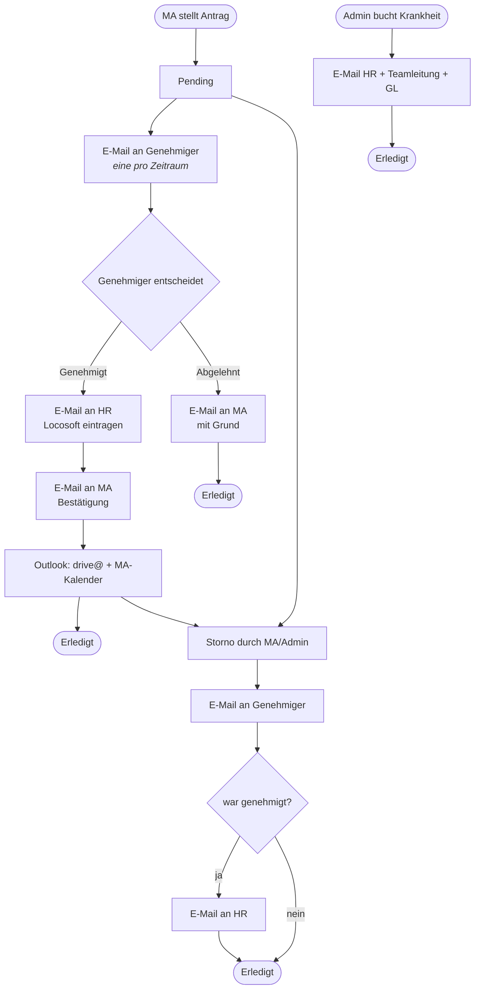
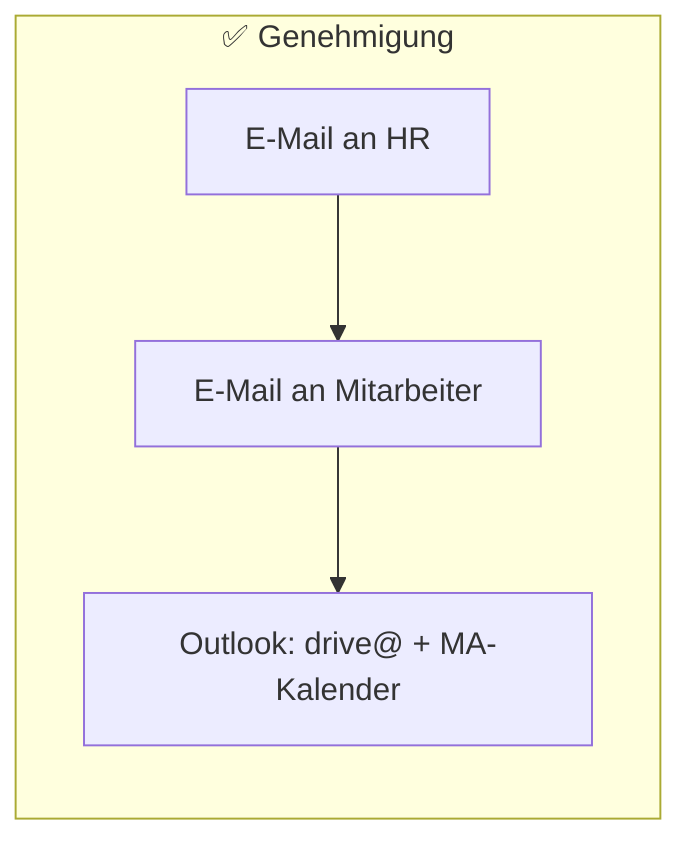

# Urlaubsplaner: Mockup mit Mermaid und Eigenlösung

**Workstream:** Urlaubsplaner  
**Stand:** 2026-03-12

---

## 1. Mermaid – gleicher Ablauf wie n8n (event-basiert)

Entspricht dem n8n-Mockup: **ein Einstieg (Webhook/Event)** → **Verzweigung nach Event** → pro Zweig die Schritte.

---

## 2. Mermaid – Prozess-Phasen (für HR/GF)

Darstellung nach **Phasen** (Antrag → Genehmigung/Ablehnung/Storno), ohne technische Events – gut für Doku und Präsentation.

---

## 3. Mermaid – als Vorlage für „aus Konfiguration generiert“ (Eigenlösung)

Wenn der Workflow in der **DB** als Schritte gespeichert wird, kann DRIVE daraus **Mermaid-Code erzeugen** und in der Admin-UI anzeigen. Beispiel: Konfiguration = Liste von Schritten mit `event`, `order`, `label`, `active`.

**Beispiel-Konfiguration (logisch):**

| event   | order | step_label                    | active |
|---------|-------|-------------------------------|--------|
| book    | 1     | 5 Sek warten (Bündelung)      | true   |
| book    | 2     | E-Mail an Genehmiger          | true   |
| approval| 1     | E-Mail an HR                   | true   |
| approval| 2     | E-Mail an Mitarbeiter          | true   |
| approval| 3     | Outlook: drive@ + MA-Kalender | true   |
| reject  | 1     | E-Mail an MA (Ablehnung)      | true   |
| cancel  | 1     | E-Mail an Genehmiger          | true   |
| cancel  | 2     | Wenn war_approved: E-Mail an HR| true   |
| sickness| 1     | E-Mail HR + Teamleitung + GL  | true   |

**Generiertes Mermaid (Beispiel für einen Zweig):**

Die Eigenlösung würde aus der Tabelle `vacation_workflow_steps` pro `event` die aktiven Schritte in Reihenfolge laden und daraus solche Subgraphs bauen (oder ein gemeinsames flowchart mit allen Zweigen).

---

## 4. Eigenlösung – wie es aussehen könnte

### 4.1 Komponenten

| Komponente        | Inhalt |
|-------------------|--------|
| **DB**            | Tabelle z. B. `vacation_workflow_steps` (event, order_index, step_type, label, config_json, active). Optional: `email_templates` (key, subject, body_html), `workflow_settings` (hr_emails, genehmiger_mail_an, …). |
| **Admin-UI**      | Eine Seite unter Urlaubsplaner-Admin oder Rechteverwaltung: Liste der Schritte pro Event, Drag-&-Drop Reihenfolge, Checkbox „aktiv“, pro Schritt Konfig (z. B. Empfänger-Vorlage). |
| **Diagramm**      | Entweder (A) **Mermaid:** Backend erzeugt aus der Konfiguration Mermaid-Text, Frontend rendert mit [mermaid.js](https://cdn.jsdelivr.net/npm/mermaid/dist/mermaid.min.js) in einer Box. Oder (B) **Eigenes Layout:** Gleiche Daten, Frontend zeichnet feste Boxen + Pfeile (z. B. mit CSS Grid/Flexbox oder einfachem SVG). |
| **Ausführung**    | Unverändert in `vacation_api.py`: Nach book/approve/reject/cancel/sickness wird die **aktive** Workflow-Konfig gelesen und nur die eingeschalteten Schritte ausgeführt (E-Mail, Kalender). |

### 4.2 Visuelles Mockup der Admin-UI (Eigenlösung)

Eine statische HTML-Vorschau (ohne Backend) liegt unter **`mockup_eigenloesung_workflow_preview.html`**: dort siehst du

- eine **konfigurierbare Schritte-Liste** (pro Event, mit Reihenfolge und aktiv an/aus),
- ein **Diagramm** (per Mermaid aus den gleichen Schritten gerendert),

damit du siehst, wie „editierbarer Workflow + Diagramm aus Konfiguration“ in DRIVE aussehen könnten.

---

## 5. Wo kann man was editieren? n8n vs. Eigenlösung

**Unterscheidung:** Was ist **von Anwendern mit Admin-Rolle** änderbar (UI / n8n-Editor) – und was ist **nur durch Code** (Entwickler) änderbar?

### 5.1 n8n

| Was | Von Anwender (Admin) änderbar | Nur durch Code änderbar |
|-----|-------------------------------|--------------------------|
| **Schritte ein-/aus, Reihenfolge** | Ja – im n8n-Editor: Knoten hinzufügen/löschen, Kanten umziehen. | – |
| **E-Mail-Empfänger, Betreff, Text** | Ja – am E-Mail-Knoten „To“, Subject, Body (inkl. Ausdrücke wie `{{ $json... }}`) bearbeiten. | – |
| **Verzögerung (z. B. 5 Sek)** | Ja – am Wait-Knoten Wert ändern oder weiteren Wait einfügen. | – |
| **Bedingungen (IF)** | Ja – IF-Knoten bearbeiten, neue Zweige anlegen. | – |
| **Neue Events/Zweige** | Ja – am Switch neuen Ausgang, Knoten verbinden. | – |
| **Credentials** (E-Mail, Graph) | Ja – in n8n Credential-Store anlegen, am Knoten zuweisen. (Kein App-Code.) | – |
| **Webhook-URL / Aufruf von DRIVE** | URL/Path in n8n einsehbar/änderbar; **welche Payload DRIVE sendet** und **dass DRIVE n8n aufruft** | Nur in DRIVE: in `vacation_api.py` (oder Config) – welcher Webhook, welches Payload-Format. |

**Kurz n8n:** Fast alles ist **von Admin im n8n-Editor** änderbar. Nur die **Integration auf DRIVE-Seite** (ob und wie DRIVE n8n aufruft, Payload-Struktur) ist **Code/Config in DRIVE**.

### 5.2 Eigenlösung (DRIVE)

| Was | Von Anwender (Admin-Rolle) änderbar | Nur durch Code änderbar |
|-----|-------------------------------------|-------------------------|
| **Schritte ein-/aus** | Ja – Admin-UI: Checkbox „aktiv“ pro Schritt (wenn UI gebaut). | Neue Schritttypen oder neue Events = neuer Code in `vacation_api` / DB-Schema. |
| **Reihenfolge der Schritte** | Ja – Admin-UI: Drag-&-Drop oder Order (wenn UI gebaut). | – |
| **E-Mail-Empfänger** (HR, GL, …) | Ja – wenn Admin-UI/DB-Tabelle dafür existiert (z. B. „HR-E-Mails“, „Empfänger Krankheit“). | Ohne UI: nur in Config/.env oder DB per SQL. |
| **E-Mail-Betreiff / -Text (Vorlagen)** | Ja – wenn Admin-UI für Vorlagen (z. B. `email_templates`) gebaut ist. | Ohne UI: Vorlagen in Code oder DB per Migration/SQL. |
| **Verzögerung** (z. B. 5 Sek) | Ja – wenn Konfig pro Schritt in Admin-UI (z. B. `delay_seconds`) angeboten wird. | Ohne UI: in Code oder Config. |
| **Bedingungen** (z. B. nur wenn genehmigt) | Nur begrenzt – z. B. „Schritt nur wenn war_approved“ als Option pro Schritt (wenn umgesetzt). | IF-Logik, neue Bedingungen = Code in `vacation_api`. |
| **Neue Events / neue Zweige** | Neue Einträge in Schritte-Tabelle nur für **bereits vom Code unterstützte** Events. | Neue Event-Arten, neue Ablauf-Logik = Code (API, Celery, DB). |
| **Credentials** (E-Mail, Graph) | Nein – in der Eigenlösung typischerweise keine Credential-UI. | .env, Config, ggf. Secrets-Management. |
| **Diagramm** | Nur anzeigen (aus Konfig generiert). Bearbeitung indirekt über Schritte-Liste. | Logik „Diagramm aus Konfig erzeugen“ = Code. |

**Kurz Eigenlösung:** **Anwender (Admin):** Schritte an/aus, Reihenfolge, Empfänger, Vorlagen, ggf. Verzögerung – **nur soweit die Admin-UI/DB das anbietet**. **Nur Code:** Neue Schritttypen, neue Events, Bedingungen, Credentials, alles was keine UI hat.
