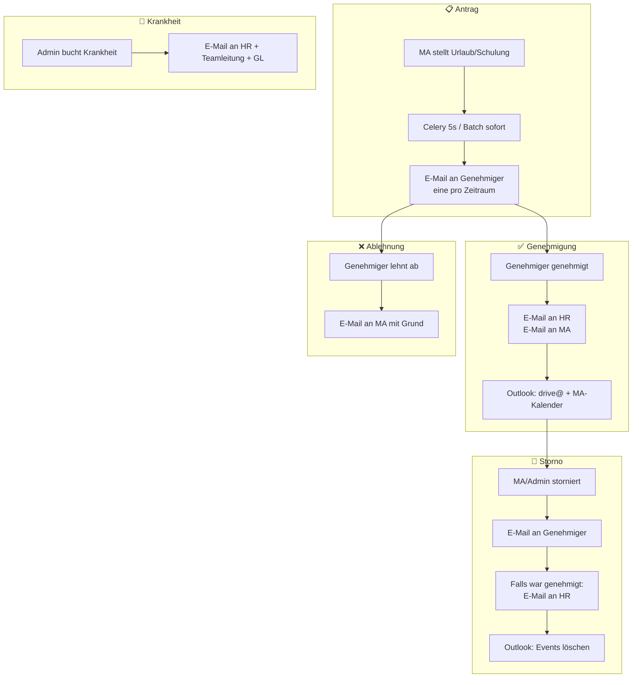

# Urlaubsplaner: Workflow, n8n-Migration und Visualisierung für HR/GF

**Workstream:** Urlaubsplaner  
**Stand:** 2026-03-12

---

## 1. Aktueller Workflow (Überblick)

Der E-Mail- und Benachrichtigungs-Workflow ist **ereignisgesteuert** und eng mit der **DRIVE-Business-Logik** (Genehmiger, Rechte, DB, Microsoft Graph) verknüpft.

### 1.1 Ereignisse und ausgelöste Aktionen

| Ereignis | Auslöser (wo) | Aktionen (E-Mail / Kalender / Sonstiges) |
|----------|----------------|------------------------------------------|
| **Neuer Urlaubsantrag** (Einzelbuchung) | `POST /api/vacation/book` | Celery-Task (5 s Verzögerung, `task_id=vacation_approver_{employee_id}`) → **E-Mail an Genehmiger** (eine Mail pro zusammenhängendem Zeitraum); Buchungen werden mit `approver_notification_sent_at` markiert. |
| **Neuer Urlaubsantrag** (Buch-Batch) | gleiche API, Batch-Pfad | **E-Mail an Genehmiger** sofort (eine Mail), alle Buchungen sofort als „Benachrichtigung gesendet“ markiert. |
| **Genehmigung** (Einzel/Batch) | `POST /api/vacation/approve` | **E-Mail an HR** (Locosoft eintragen); **E-Mail an Mitarbeiter** (Bestätigung); **Outlook:** Eintrag in Kalender **drive@** + **persönlicher Kalender** des Mitarbeiters. |
| **Ablehnung** | `POST /api/vacation/reject` | **E-Mail an Mitarbeiter** (mit optionalem Grund). |
| **Stornierung** | `POST /api/vacation/cancel` | **E-Mail an Genehmiger** (zur Info); falls vorher genehmigt: **E-Mail an HR** (Storno in Locosoft berücksichtigen); **Outlook:** Event in drive@ und Mitarbeiter-Kalender **löschen**. |
| **Krankheit** (Admin bucht) | `POST /api/vacation/book` mit `vacation_type_id=5` | **E-Mail an HR + Teamleitung (Prio-1-Genehmiger) + GL** (Info, keine Genehmigung). |

### 1.2 Technische Abhängigkeiten

- **E-Mail:** Microsoft Graph über `api/graph_mail_connector.py` (DRIVE_EMAIL, HR_EMAILS aus Umgebung).
- **Kalender:** `api/vacation_calendar_service.py` – drive@ + Mitarbeiter-Kalender (M365), Event-IDs in `vacation_bookings` für Storno-Löschung.
- **Genehmiger/Empfänger:** `api/vacation_approver_service.py` – LDAP/AD-Gruppen, Organigramm, `get_approvers_for_employee`, `get_team_for_approver`.
- **Verzögerte Benachrichtigung:** Celery-Task `send_vacation_approver_notification(employee_id)` in `celery_app/tasks.py`; Aufruf aus `vacation_api.py` mit `apply_async(..., countdown=5, task_id=...)`.

### 1.3 Warum der Workflow „komplex“ wirkt

- Mehrere **E-Mail-Typen** (Genehmiger, HR, MA, Storno, Krankheit) mit unterschiedlichen Empfängerlogiken.
- **Zeitraum-Bündelung** bei Genehmiger-Mails (eine Mail pro zusammenhängendem Zeitraum, nicht pro Tag).
- **Celery** für Entlastung (5 s Verzögerung, Deduplizierung pro Mitarbeiter).
- **Zwei Kalender-Ziele** (drive@ + Mitarbeiter) und Storno-Löschung.
- **Rechte:** Wer darf genehmigen/ablehnen/stornieren (Admin, Genehmiger, Team), abhängig von Organigramm/LDAP.

---

## 2. Sinn einer Migration des Workflows nach n8n?

### 2.1 Was n8n leisten könnte

- **Trigger:** Webhook (z. B. „Bei Buchung/Genehmigung/Storno“) – DRIVE müsste n8n per HTTP aufrufen.
- **Knoten:** E-Mail (z. B. SMTP oder Microsoft 365), HTTP, DB-Abfragen, Verzweigungen, Warten (z. B. 5 s).
- **Visualisierung:** Der Ablauf wäre als **Diagramm** sichtbar (Knoten + Kanten).

### 2.2 Argumente **gegen** eine vollständige Migration nach n8n

| Punkt | Begründung |
|-------|------------|
| **SSOT und Logik im DRIVE** | Wer genehmigt wen, wer bekommt welche Mail, Zeitraum-Bündelung, Kalender-Zuordnung – das hängt an **employees**, **vacation_approval_rules**, **vacation_bookings**, LDAP und Organigramm. Diese Logik liegt sinnvoll in **einer** Codebasis (Flask + vacation_api + vacation_approver_service). In n8n zu duplizieren oder per viele HTTP-Calls abzufragen wäre fehleranfällig und schwer zu warten. |
| **Bereits bewährte Architektur** | E-Mails und Kalender werden **direkt** aus den API-Routen aufgerufen; ein Celery-Task übernimmt nur die **verzögerte Genehmiger-Mail**. Das ist überschaubar und gut testbar. |
| **Redundanz** | Ein zweites Orchestrierungssystem (n8n) neben Celery/Flask erhöht Wartung, Dokumentation und die Frage „Wo läuft was?“ (vgl. Controlling: `CASHFLOW_VORGEHEN_PYCASHFLOW_N8N.md`). |
| **Microsoft Graph** | DRIVE nutzt bereits Graph (Mail + Kalender) mit bestehenden Credentials und Fehlerbehandlung. In n8n müsste Graph erneut angebunden und Credential-Verwaltung geklärt werden. |
| **Kein „Low-Code“-Bedarf für Logik** | Die Fachlogik (Vertretungsregel, Abwesenheitsgrenzen, Urlaubssperren, Resturlaub) bleibt im DRIVE. n8n würde nur „E-Mail versenden“ und „Event anlegen/löschen“ übernehmen – das ist bereits klar in wenigen Funktionen gebündelt. |

### 2.3 Wann n8n **sinnvoll** wäre

- Wenn **HR/GF** künftig **ohne Entwickler** neue E-Mail-Empfänger, Verzögerungszeiten oder „Wenn X dann E-Mail an Y“-Regeln ändern sollen und dafür eine **visuelle Oberfläche** gewünscht wird.
- Wenn viele **externe Systeme** (nicht nur Graph) in den Ablauf sollen (z. B. Ticketing, Chat, weitere SaaS) und n8n als **Kleber** dient.
- Wenn aus **Compliance/Dokumentation** ein **exportierbares, visuelles Workflow-Diagramm** verlangt wird – dann reicht ggf. **nur Visualisierung** (siehe Abschnitt 3), ohne die Ausführung nach n8n zu verlagern.

### 2.4 Empfehlung

- **Den bestehenden Workflow nicht nach n8n migrieren.** Logik, Genehmiger-Logik, Kalender und E-Mail-Aufrufe bleiben im DRIVE (Flask + Celery).
- **Optional:** Wenn n8n **bereits** für andere Use Cases (z. B. Integrationen) eingeführt wird, kann DRIVE in Einzelfällen **n8n per Webhook aufrufen** (z. B. „Urlaub genehmigt“), und n8n führt **zusätzliche** Aktionen aus (z. B. Logging, zweites System). Die **primäre** E-Mail- und Kalender-Logik bleibt im DRIVE.

---

## 3. Visualisierung für HR und GF

### 3.1 Anforderung

- **Visuell darstellen:** Welche Schritte passieren wann (Antrag → Genehmiger-Mail → Genehmigung → HR/MA-Mail, Kalender, Storno, Krankheit)?
- **Teilweise editierbar:** z. B. Empfänger (HR-E-Mails), Texte/Vorlagen, ob bestimmte Mails ein-/ausschaltbar sind.

### 3.2 Option A: Visuelles Diagramm **ohne** n8n (empfohlen)

- **Dokumentation:** Ein **statisches Diagramm** (z. B. Mermaid in einer Markdown-Datei oder als Bild) im Repo bzw. unter `docs/workstreams/urlaubsplaner/`, das den Ablauf beschreibt (wie in Abschnitt 1.1).
- **Vorteil:** Keine neue Infrastruktur, keine Abhängigkeit von n8n; HR/GF können die Doku lesen und das Diagramm in Präsentationen nutzen.
- **Editierbarkeit:** Konfiguration (z. B. HR-Empfänger, DRIVE_EMAIL) bleibt in **Umgebung/Config**; ggf. kleines **Admin-UI** im DRIVE (z. B. „E-Mail-Empfänger für Urlaub“) statt n8n-Editor.

### 3.3 Option B: n8n **nur** zur Visualisierung

- n8n-Workflow **nachbilden**, der den Ablauf **abbildet**, aber **nicht** die echten Mails/Kalender steuert („Dummy“-Knoten oder nur Dokumentation in n8n).
- **Nachteil:** Doppelpflege (DRIVE-Code + n8n-Diagramm); n8n muss dafür betrieben werden. Nur lohnend, wenn n8n ohnehin produktiv im Einsatz ist.

### 3.4 Option C: Konfigurierbarkeit im DRIVE (editierbar für HR/GF)

- **Empfänger:** HR-E-Mails bereits über `HR_EMAILS` (Umgebung); optional in DB-Tabelle oder Admin-UI pflegbar.
- **Mail-Texte/Vorlagen:** Aktuell in `vacation_api.py` (HTML-Strings). **Editierbar** machbar über: Tabelle `email_templates` (key, subject, body_html) + Admin-Seite „Urlaubs-E-Mails“ (nur GF/Admin). Dann lädt die API die Vorlage und füllt Platzhalter.
- **Ein/Aus pro Benachrichtigung:** z. B. Konfig „Genehmiger-E-Mail aktiv“, „HR-E-Mail bei Genehmigung aktiv“, „Mitarbeiter-Bestätigung aktiv“ in Config oder DB – in den bestehenden Funktionen nur noch if-Abfrage.

Damit ist **Visualisierung** (Dokumentation + ggf. Mermaid-Diagramm) und **teilweise Editierbarkeit** (Empfänger, Vorlagen, Schalter) **ohne n8n** umsetzbar.

---

## 4. Konkrete nächste Schritte (Vorschlag)

| Priorität | Maßnahme |
|-----------|----------|
| 1 | **Workflow-Diagramm** in diesem Ordner ergänzen (z. B. Mermaid in dieser Datei oder separate `URLAUBSPLANER_WORKFLOW_DIAGRAMM.md`), basierend auf Abschnitt 1.1 – für HR/GF zur Darstellung. |
| 2 | **CONTEXT.md** um Verweis auf dieses Dokument und auf das Diagramm erweitern. |
| 3 | **Editierbarkeit:** Nur wenn von HR/GF gewünscht: (a) HR-Empfänger in Admin-UI oder DB pflegen, (b) optionale Tabelle für E-Mail-Vorlagen + einfache Admin-Ansicht (GF). |
| 4 | **n8n:** Weder Migration noch Auslagerung der Kern-E-Mails/Kalender; nur erwägen, wenn n8n anderweitig eingeführt wird und zusätzliche Webhook-Aktionen gewünscht sind. |

---

## 5. Kurzfassung

| Frage | Antwort |
|-------|---------|
| **Workflow in n8n abbilden/migrieren?** | **Nein.** Logik und Versand bleiben im DRIVE (SSOT, Wartbarkeit, bestehende Graph/Celery-Integration). |
| **Visuell für HR/GF darstellen?** | **Ja**, sinnvoll – als **Dokumentation + Diagramm** (z. B. Mermaid) im Repo, ohne n8n. |
| **Teilweise editierbar?** | **Ja**, sinnvoll – **im DRIVE** umsetzbar: Empfänger (HR), optionale E-Mail-Vorlagen, Schalter pro Benachrichtigungstyp; ggf. kleines Admin-UI. n8n ist dafür nicht nötig. |

---

## 6. Workflow-Diagramm (für HR/GF)

Nachfolgend der Ablauf als **Mermaid-Diagramm** – nutzbar in Doku, Confluence oder Präsentationen (z. B. [Mermaid Live](https://mermaid.live) zum Export als Bild).

**Legende:** MA = Mitarbeiter; HR = konfigurierte HR-E-Mails; Genehmiger = aus Organigramm/LDAP; Outlook = drive@ + persönlicher M365-Kalender.

**Mockups:**
- **n8n:** `n8n_mockup_urlaubsplaner.json` (Import in n8n), `n8n_mockup_urlaubsplaner_preview.html`, `n8n_mockup_urlaubsplaner_README.md`.
- **Mermaid + Eigenlösung:** `MOCKUP_URLAUBSPLANER_MERMAID_EIGENLOESUNG.md` (Mermaid-Varianten + Beschreibung Eigenlösung), `mockup_eigenloesung_workflow_preview.html` (Admin-UI-Mockup mit Schritte-Liste + generiertem Diagramm).

---

## 7. Grafischer, editierbarer Workflow (Kanban/Prozess) – mit oder ohne n8n?

**Anforderung:** Workflow **grafisch darstellen** und **editierbar** machen (Stichwort Kanban-Prozess), ohne zwingend auf n8n zu setzen.

### Option A: Ohne n8n – Workflow in DRIVE (DB + UI)

| Was | Wie |
|-----|-----|
| **Definition** | Workflow-Schritte in **DB** speichern (z. B. Tabelle `vacation_workflow_steps`: Schritt, Reihenfolge, Typ z. B. „E-Mail Genehmiger“, „E-Mail HR“, „Kalender“, aktiv ja/nein, Konfig z. B. Empfänger/Vorlage). |
| **Grafik** | **Diagramm aus Konfig erzeugen:** z. B. Mermaid-Code aus den Schritten generieren und im Frontend rendern (Mermaid.js) oder vordefinierte SVG/HTML-Boxen mit Beschriftung aus DB. Kein Drag-&-Drop-Editor, aber **klare visuelle Darstellung**. |
| **Editierbar** | **Admin-Seite** (nur GF/Admin): Schritte ein-/ausblenden, Reihenfolge (z. B. Drag-&-Drop-Liste), Empfänger (HR), E-Mail-Vorlagen pro Schritt, Schalter „E-Mail an Genehmiger aktiv“. Ausführung bleibt in Flask/Celery wie heute; die API liest die aktive Workflow-Konfig und führt nur die eingeschalteten Schritte aus. |

**Vorteile:** Keine neue Infrastruktur, eine Codebasis, SSOT in DRIVE, Rechte über bestehendes Auth.  
**Nachteile:** Kein „echter“ Knoten-Editor (Kanten ziehen etc.); eher **strukturierte Liste + Diagramm-Preview** als voller Flow-Editor.

---

### Option B: n8n als Plugin für Urlaubsplaner

| Was | Wie |
|-----|-----|
| **Definition + Grafik** | Workflow **in n8n** modelliert: Knoten = Schritte (Webhook, E-Mail, Warten, Kalender …), Kanten = Ablauf. **Direkt editierbar** im n8n-Editor (drag & drop, Verbindungen). |
| **Ausführung** | DRIVE ruft nach Buchung/Genehmigung/Storno n8n-Webhook auf; n8n führt E-Mails/Kalender aus. |
| **Editierbar** | HR/GF bearbeiten den Ablauf in der n8n-Oberfläche (Knoten hinzufügen/entfernen, Reihenfolge, Bedingungen). |

**Vorteile:** Grafischer Workflow ist von Haus aus da und wirklich editierbar (Knoten/Kanten).  
**Nachteile:** Zweites System (n8n) betreiben, Credentials/Graph in n8n, bei Fehlern zwei Orte prüfen.

---

### Option C: Alternative „Plugin“ (Low-Code-Workflow)

- **Node-RED:** Ähnlich n8n, flow-basiert, oft für IoT/Integration; weniger auf Business-Prozesse fokussiert, aber möglich.
- **Camunda / Flowable:** BPMN-Engine mit grafischem Editor; sehr mächtig, aber Aufwand und eher für große Prozesslandschaften.
- **Temporal:** Workflow-Engine für Entwickler, keine „HR-editierbare“ Oberfläche.

Für **einen** Prozess (Urlaubsplaner) und Ziel „HR/GF kann Prozess sehen und anpassen“ sind diese Alternativen entweder zu leicht (Node-RED) oder zu schwer (Camunda). **Pragmatische Alternative zu n8n** wäre nur Node-RED, wenn ihr es ohnehin einsetzt – sonst gleiche Abwägung wie n8n.

---

### Empfehlung

| Ziel | Empfehlung |
|------|------------|
| **Nur Grafik + begrenzt editierbar** (Schritte an/aus, Reihenfolge, Empfänger, Vorlagen) – **ohne neues System** | **Option A:** Workflow-Schritte in DRIVE (DB), Admin-UI zum Bearbeiten, Diagramm aus Konfig (z. B. Mermaid) anzeigen. Ausführung weiter in Flask/Celery. |
| **Wirklich grafisch „am Flow“ editierbar** (Knoten/Kanten wie in n8n), und ihr seid bereit, ein zweites System zu betreiben | **Option B:** n8n als Plugin; DRIVE nur SSOT + Webhook, n8n = Editor + Ausführung für Benachrichtigungen/Kalender. |

**Kurz:**  
- **Ohne n8n:** Ja, grafischer editierbarer Workflow geht – als **konfigurierbare Schritte in DRIVE** mit Diagramm-Preview (z. B. Mermaid) und Admin-Formular (Kanban-artig: Spalten = Phasen, Schritte pro Phase ein-/ausblenden, Reihenfolge).  
- **Mit n8n:** Besser, wenn ihr einen **vollwertigen Flow-Editor** (Knoten/Kanten) und eine Oberfläche wollt, die HR/GF ohne Entwickler anpassen können – dafür dann n8n als Plugin wie zuvor beschrieben.

---

---

## 8. n8n-Potenzial in DRIVE (wenn ihr euch für n8n entscheidet)

Falls n8n z. B. für den Urlaubsplaner eingeführt wird, lohnt sich der Blick, **wo es in DRIVE noch sinnvoll** wäre. Übersicht aus der bestehenden Codebasis (Celery-Tasks, E-Mail-Versand, Integrationen):

### 8.1 Event-getriebene Benachrichtigungen (wie Urlaubsplaner)

| Bereich | Heute | n8n-Potenzial |
|---------|--------|----------------|
| **Urlaubsplaner** | E-Mails/Kalender in vacation_api + Celery | ✅ Klassischer Kandidat: DRIVE Webhook → n8n (E-Mail, Kalender), editierbarer Flow. |
| **Serviceberater bei Zeitüberschreitung** | Celery alle 15 Min: Locosoft-Abfrage → Logik → E-Mail an Serviceberater | Mittel: DRIVE könnte „Überschreitungen“ per API liefern, n8n ruft API + versendet E-Mail. Oder n8n-Cron → DRIVE-API → n8n E-Mail. Empfänger/Text dann in n8n editierbar. |
| **ServiceBox Passwort-Ablauf** | Celery täglich 8:00: Prüfung → E-Mail an Servicelieter | Gering: Einfacher Zeitplan + eine E-Mail; n8n möglich (Cron → HTTP zu DRIVE-Check → E-Mail), aber Aufwand/Nutzen eher gering. |

### 8.2 Geplante E-Mail-Reports (heute Celery)

| Report | Schedule (Beispiel) | n8n-Potenzial |
|--------|----------------------|----------------|
| Auftragseingang | Mo–Fr 17:15 | **Hoch:** n8n-Cron → HTTP GET z. B. `/api/.../auftragseingang-report` (DRIVE liefert Daten oder HTML) → n8n versendet E-Mail. Empfänger/Zeitpunkt in n8n änderbar. |
| Werkstatt-Tagesbericht | Mo–Fr 17:30 | Wie oben: DRIVE = Daten/SSOT, n8n = Zeitplan + Versand. |
| TEK täglich | Mo–Fr 19:30 | Wie oben. |
| AfA Bestand / Verkaufsempfehlungen | 20:00 / 20:15 | Wie oben. |
| Daily Logins | 17:30 | Wie oben. |
| Penner Wochenreport | Mo 7:00 | Wie oben. |

**Muster:** DRIVE behält die **Report-Logik** (eine API liefert Inhalt oder fertiges HTML); n8n übernimmt **Zeitplan + E-Mail-Versand**. Dann können GF/Controlling Empfänger, Uhrzeiten und ggf. Vorlagen in n8n anpassen.

### 8.3 Integrationen / Datenfluss

| Bereich | Heute | n8n-Potenzial |
|---------|--------|----------------|
| **WhatsApp (eingehend)** | Twilio Webhook oder Celery-Polling → `process_inbound_message` | n8n könnte Webhook-Empfänger sein → Nachricht an DRIVE-API übergeben; Auto-Antworten oder Weiterleitung in n8n konfigurierbar. Optional. |
| **WhatsApp (ausgehend)** | Celery-Task `send_whatsapp_message` | Wie Urlaub: DRIVE löst aus (SSOT), n8n-Webhook sendet Nachricht (Twilio-Node). Ein Workflow für alle „Nachricht versenden“-Fälle. |
| **MT940 / Bank-Import** | Celery 3× täglich, Python parst Dateien | **Gering:** Parsing und DB-Schreiben sinnvoll in DRIVE. n8n höchstens als **Trigger** (Cron → HTTP POST zu DRIVE), Ausführung bleibt in DRIVE. |
| **Sync (Locosoft, eAutoseller, Stammdaten …)** | Celery, teils komplexe Logik | **Gering:** Sync-Logik in DRIVE lassen; n8n nur optional als Scheduler (Cron → Aufruf DRIVE-Endpoint). |

### 8.4 Zusammenfassung: Wo n8n in DRIVE Potenzial hat

| Priorität | Einsatz | Begründung |
|-----------|---------|------------|
| **1** | **Urlaubsplaner** (E-Mails + Kalender) | Event-getrieben, viele Schritte, gut als ein Workflow abbildbar, editierbar für HR/GF. |
| **2** | **Geplante E-Mail-Reports** (Auftragseingang, TEK, AfA, Werkstatt, Logins, Penner) | Einheitliches Muster: DRIVE-API liefert Inhalt, n8n plant und versendet; Empfänger/Zeiten in n8n änderbar. |
| **3** | **Serviceberater-Benachrichtigungen** | „Wenn Überschreitung dann E-Mail“ – DRIVE liefert Liste, n8n versendet; Anpassung ohne Code. |
| **4** | **WhatsApp** (ausgehend / ggf. eingehend) | Ein Webhook-Workflow für Versand; ggf. eingehende Nachrichten über n8n an DRIVE anbinden. |
| **5** | **Nur Trigger für Imports/Sync** | n8n nur als Cron → HTTP zu DRIVE; keine Logik-Verlagerung. |

**Fazit:** Das meiste Potenzial liegt bei **ereignis- oder zeitgesteuerten Benachrichtigungen und Reports**: DRIVE bleibt SSOT für Daten und Fachlogik, n8n für **Zeitplan, Empfänger, E-Mail-/Nachrichten-Versand** und – beim Urlaubsplaner – für den **grafisch editierbaren Ablauf**. Schwere Datenverarbeitung (MT940, Locosoft-Sync, ServiceBox-Pipeline) bleibt sinnvoll in DRIVE.

---

*Referenzen: CONTEXT.md (Urlaubsplaner), CLAUDE.md, CASHFLOW_VORGEHEN_PYCASHFLOW_N8N.md (Controlling-Einschätzung n8n).*
